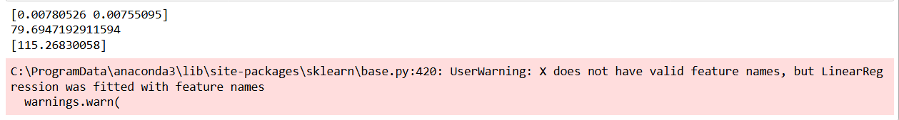

# Implementation of Multivariate Linear Regression
## Aim
To write a python program to implement multivariate linear regression and predict the output.
## Equipment’s required:
1.	Hardware – PCs
2.	Anaconda – Python 3.7 Installation / Moodle-Code Runner
## Algorithm:
### Step 1
Import required libraries and load the dataset.

### Step 2
Define the feature matrix and target vector.

### Step 3
Create a Linear Regression model and train it using the data.

### Step 4
Predict outputs, evaluate the model.

### Step 5
End the program.
## Program:
```Python
# Register No:212225040347
# Developed By:Rohith G
import pandas as pd
from sklearn import linear_model
df=pd.read_csv("car (1).csv")
x=df[["Volume","Weight"]]
y=df["CO2"]
regression=linear_model.LinearRegression()
regression.fit(x,y)
print(regression.coef_)
print(regression.intercept_)
print(regression.predict([[3300,1300]]))
```
## Output:


## Result
Thus the multivariate linear regression is implemented and predicted the output using python program.